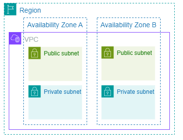

### Data_Science_And_Engineering_Notebook

`Setting the scene`

As you go through this material, picture yourself as a new data engineer hire in your organization. Your objective will be to understand the needs of your stakeholders, adopting a first principles approach to align and translate the needs of the buiness into technical solutions.  

## Research Notes on Data Science and Engineering

## What is Data Engineering?
Data Engineering is the development, implementation, and maintenance of systems and processes that take in raw data (generate and ingest), transforms it and produce high-quality consistent information that supports downstream use cases such as analysis and machine learning. Data Engineering sits at the intersection of security, data operations (Data Ops), data architecture, Data management and software engineering.

### Data Engineering Lifecycle: The core stages of the data engineering lifecyle are as follows:
      Generation, Ingestion, Transform(ation), Storage, Serving...

*Note: Data storage is happening constantly throughout the entire lifecycle of the data engineering pipeline*   
- `Generation`:
  * The data used in the data engineering lifecyle originates within/from source systems.For example, a source system could be an IOT device, an application message queue, or a transactional database. A data engineer needs to have a working knowledge of how a given source system operates, generates its data, the frequency, velocity and variety of the data it generates. Engineers need to maintain a line of communication with source systems owners to stay up-to-date on changes that can impact data pipelines and analytics.

     - `The following questions can be asked to evaluate a source system:`
     - What are the essential characteristics of the data source? Is it an application? or A swarm of IoT devices?
     - How is the data generated?
     - How dynamic is the data over time?
     - Does the data persist long term or short term before deletion?
     - What is the speed of generation and what are the rate of errors, if any? This is known as the latency
     - What is the schema of the ingested data?
     - How frequently should data be pulled from the source system?
     - Will reading data from its source impact its performance?
As a data engineer, developing and having a good working professional relationship with the stakeholders of source systems you'll be working with is a crucial piece of data engineering success.They will help avoid unecessary pitfalls as they have proximity to your data sources.

- `Storage`:
  * Choosing a storage solution is key to success across the rest of the data lifecycle. Storage is also one of the more complicated stages of the lifecycle for a number of reasons.
  * First is that cloud storage solutions often requires use of more than a single source of truth. Storage solutions are rarely exclusively purposed for storage. They can be used for transformation capabilities as well. Amazon S3 select is good example of this. While storage is a phase of the data engineering lifecycle, it frequently touches on other stages, such as ingestion, transformation, and serving. In many ways, the way data is stored impacts how it is used in all of the 
    stages of the data engineering lifecyle. For instance, cloud warehouses can store data, process data in pipelines, and serve it to analysts. Streaming frameworks such as Apache Kafka, and Pulsar can ingest, store and query systems for messages, with object storage being a standard layer for data transmission.

        Understanding Data Access Frequency:
         * Data retrieval patterns will vary based on the data being stored and how often it is queried.
         Data access frequency will determine the temperature of the data. Data that is most frequently accessed is known as `hot data`.
           Hot data is commonly retreived multiple times per day. For example, systems that service user requests
           CRM systems, ticketting systems etc. And then, there is `lukewarm data` and `cold data` that are less frequently accessed.
 
  *Storage Hierarchy* 
  - The bottom layer of the hierachy consists of raw storage ingredients like SSD and magnetic disks, along with processes like networking, serialization, and compression.
  - The middle layer consists of storage systems like databases and object storage that are built on top of the raw ingredients.
  - The top layer consists of the bottom and middle layers arranged into storage abstractions like data warehouse, data lakes, and data lakehouses.

-  `Ingestion`:
      * Source systems and Ingestion presents the most significant bottle-necks of the data engineering lifecycle. This is because the engineer has little to no control of the management of these two processes. Unreliable source and ingestion systems have ripple effects across the data engineering lifecyle. To architect and build a system, the following considerations are critical to keep in mind:
        - What are the use cases for the data being ingested? Is the data good for reuse rather than creating multiple versions of the same dataset?
        - How frequently will the data be accessed?
        - Is the data being reliably generated and available on demand?
        - In what volume will the data typically arrive?
             * Will you doing a batch processing or a stream processing ingestion
        - What format is the data in? Can your downstream storage and transformation systems handle this format?
        - Is the source data in good shape for immediate downstream use? And for how long?
       
          `Batch Ingestion`: is a convenient way to process stream of events in large chunks based on a predetermined time interval or on a preset            size threshold. E.g an entire day's worth of data can he handled in a single batch. This is a practical and widely used way of                     processing data for analytics and machine learning.
          
          `Streaming Ingestion`: is providing continuous, near real-time fashion data ingestion. In this case, data is provided shortly after it is produced, usually in less than a              second. Specific tools such as event-streaming platform and message queues to continuously ingest stream of events.

        Streaming Ingestion is not necessarily the best choice for all use cases.Before using a streaming solution, you should first consider things like real-time actions, time, maintenance costs and downtime. Generally, streaming ingestion usually coexist with Batch ingestion for most workloads.

      *Before choosing streaming ingestion, it's best to indentify a business use-case that justifies the trade-offs of using stream over batch ingestion.*
          
-  `Transform-ation`
-  The transformation stage is the turning something into useful stage. It's where you as a data engineer starts to create value for your downstream stakeholders. In reality, the transformation stage is comprised of three parts namely
-        Query: this is issuing requests to read data from a database or other storage system. or other record.
-        Modeling
-        Transformation 
  
-  `Serving`

  There is also the notion of `undercurrents` - these are critical themes and concepts around the end-to-end data lifecycle. These include the following
- Security
- Data Management
- DataOps
- Data Architecture
- Orchestration
- Software Engineering
  *These "undercurrents" are aspects that will be relevant across every stage of the data lifecycle.*

## Concept of Data Maturity: 
Data Maturity in an any organization is the progression from basic towards advanced data utilization, capabilities, and integration across the organization. An Organization's Data Maturity is not a factor of the age or revenue of a company. Typically companies fall within one or more of these stages on their data maturity evolution
- `Starting with Data`
- `Scaliing with Data`
- `Leading with Data`

In general, the role of a data engineer evolves from a generalist to a specialist as an organization advances through these stages of the data maturity model.

## Business Responsibilites of a Data Engineer
- Understand how to scope and gather business and product requirements
- Know how to communicate with nontechnical and technical stakeholders in the organization
- Understand the foundations of Agile, DevOps and DataOps
- Control Costs
- Learn Continuously

A successful data engineer always zooms out to understand the big picture and how to achieve outsized value for the business. Business requirements gathering is part of the role of the data Engineer as well. Translating the business needs into technical requirements that form the framework for the data systems an engineer builds.

## Technical Responsibilities of a Data Engineer
At a high level, data engineers must understand how to build architectures that optimize performance and cost, using using off-the-shelf and proprietary components. The primary languages of data engineering are 
- `SQL`
- `Python`
- `Java` or `Scala`
- `Bash`
- `R`

The reality of the industry is that data engineers are most often than not required to understand the fundamentals of software engineering; sometimes even required to be software engineers. Thus data engineers may need to develop proficiency in secondary programming languages, including R, JavaScript, Go, Rust, C/C++, c# and Julia. 

As far as keeping ones skills sharp in a rapidly changing field like data engineering ? A good approach is to start by focusing on the fundamentals to understand what's not going to change and pay attention to ongoing developements to know know where the field is headed. 

## Notion of Type A and Type B Data Engineers

*Type A ~ Abstraction ~ Data Engineers* 

These types of data engineers in their roles avoid undifferentiated heavy lifting, keeping data architecture as abstract and straightforward as possible and not reinventing the wheel. In practice, they do not attempt to reinvent the wheel and leverage off-the-shelf products and managed services and tools. 

*Type B ~ Build ~ Data Engineers*

These types of data engineers build data tools and systems that scale and leverage a company's core competency and competitive advantage. Type A and B data engineers may work in the same company and at times may or may not be the same person!

## Key Elements of Requirement Gathering
- Learn what existing data systems or solutions are in place
- Learn what pain points or problems there are with existing solutions
- Learn what ACTION stakeholders plan to take with the data. This is very important and revealing that you may think initially
   * Repeat what you learned back to your stakeholders for alignment and identify any other stakeholders you still need to talk to fill in gaps in your
     contextual understanding of the business problems.
- Ask your stakeholders what `action` they plan to take with the data. This will help you get clarity on the end use case of the data and This is not     the same as asking what they need.

## Thinking Like a Data Engineer
- Identify business goals and stakeholder needs
  * explore existing systems and ask stakeholders what actions they will take with the data product
- Define system requirements
  * Translate stakeholder needs to functional requirements
  * define non-functional requirements
  * document and confirm requirements with stakeholders
- Choose tools and technologies to build your systems
  * perform cost/benefit analysis and choose the right tools and technologies
  * prototype and test your system, aligning with stakeholder needs
- Build, Evaluate, Iterate and Evolve your system based on stakeholder needs

**Business requirements define the high level goals of the business. Stakeholder requirements define the needs of the individuals within the organization to meet those business goals. System requirements define what a system needs to be able to do in order to meet business and stakeholder requirements*

## Data Engineering on the `AWS Cloud`:

`Cloud Computing` is the on-demand delivery of information technology (IT) resources over the internet with pay-as-you-go pricing. AWS is structured geographically across regions with multiple availability zones, which are clusters of one or more physical data centers. 

*Each AWS region contains at least 3 isolated and physically separated availability zones. Each availability zone contains a group of one or more discrete data centers with redundant power, networking and physical security.*

A Virtual Server is a software representation or emulation of an actual physical server.

A Virtual Private Cloud (VPC) exists inside a region, which can contain more than one VPC, and a VPC spans multiple  availability zones within the region. VPC is a way to isolate your AWS resources (such as EC2) from the outside world.

- Analytics, Machine Learning, and reverse ETL are the end use cases you will serve as a data engineer.
- Upstream Stakeholders represent the stakeholders that create and or/maintain the source systems you will ingest data from.
- Downstream stakeholders are the end-users to whom you're serving the data.

## AWS Core Services
- Compute Services such as AWS Elastic Compute Cloud (EC2). EC2 is a virtual server in the AWS cloud.
- Networking such as Amazon Virtual Private Cloud
- Storage (object, block and file)
    * Object storage is often used for storing unstructured data. e.g Amazon Simple Storage Service (S3)
    * Block Storage is used for database storage, virtual machine file systems, and other low-latency environments. e.g Amazon Elastic Block Storage (EBS)
    * File Storage is used to organize data into files and directories in a hierarchical structure. e.g Amazon Elastic File System (EFS)
- Security (AWS shared responsibility model)

## Compute - Amazon Elastic Compute Cloud (EC2)
- EC2 (Elastic Compute Cloud) is an example of AWS compute service which represents a virtual servers or virtual machine. A server is like a computer or set of computers that hosts and runs your applications. It consists of physical hardware (CPU, RAM, Storage, Networking components), an operating system installed on top the hardware, and finally the applications that run on top of the operating system.
- Hypervisor: A hypervisor is a software component that enables the sharing of physical computing resources among multiple virtual machines.
- Spot Instances: Spot instances are unused EC2 computing resources available at a discount compared to on-demand prices, offering cost savings for flexible workloads.
- On-Demand Instances; On-demand instances provide compute capabity with no long-term commitments, allowing users to pay for what they use.

## Networking
 - A network is simply a collection of devices connected together, where each connection can be a request sent from one device to another  or a response to a request.
 - In a given network, each device is assigned an *Internet Protocol* (IP), `which is a series of digits that uniquely identifies each device within the network`. These addresses ensure that responses and requests are sent to the correct devices
 - CIDR Notation is Classless Inter-Domain Routing. This represents the range of IP addresses that can be assigned to the devices within a particular network.
 - The following is an example of CIDR notation:

   `192.101.0.0/24`

       This notation means that the first 24 bits are fixed and the last 8 bits can be any bits. In other words, 192.101.0.0/24 represents all IP addresses between 192.101.0.0 and 192.101.0.255.
 - 
 - Virtual Private Cloud (VPC): is an isolated private network where you can launch your AWS resources. A VPC exists inside a region, which can contain more than one VPC, and a VPC spans multiple availability zones inside the region. A VPC is a way to isolate your resources such as EC2 from the outside world.
 

       When you create a VPC, you need to specify the range of IP addresses or the CIDR block for the network, which determines the size of the network. Each resource resource created inside the VPC will be assigned an IP address from the specified range.
- A Subnet: Inside your VPC, you may need some resources to be public and others to be private. Subnets provide you with a more detailed control over access to your resources. You can achieve this by creating subnets within your VPC. You can create a public and a private subnet.
- Think of a Subnet as a smaller network inside your base network. Each subnet is assigned a CIDR block, which must be a subset of the VPC CIDR block. Resources in multiple subnets of the same VPC can communicate because they are part of the same VPC. See illustration shown:
   
    

## Security
- When you host your applications and resources in the cloud, you're offloading the heavy duty of managing the physical hardware to the cloud provider. The security of the physical facility is the responsibility of the cloud provider. However, you still own your data in AWS and you have complete control of it, so you are responsible for managing its security. This is known as the `shared responsibility model` of AWS.
- AWS is responsible for the `security of the cloud`. You are responsible for the `security in the cloud`.

The process of capturing patterns from data is called fitting or training a model.The data used is called the training data. In a Decision Tree model, the point at which we work through the entire Splits and make our final prediction is called a LEAF. The Split we create in the decision tree is determined by the data we use.

Pandas is the primary tool data scientist for exploring and manipulating data. The most important part of the Pandas library is the DataFrame. A DataFrame holds the type of data you might think of as a table. This is similar to a sheet in Excel, or a table in a SQL database.

`import pandas as pd` is the command we use to provision the pandas library when analyzing a dataset.

The Eight Number Summary Statistics. 
- The pandas `describe()` method is used to calculate and provide an eight-number summary statistics of the data frame. These include
  * count (number of rows)
  * mean
  * standard deviation
  * mininum value
  * maximum value
  * Twenty-fifth percentile
  * Fiftieth-percentile
  * seventy-fifth percentile

      

